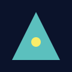

# Nuxt Content Assets 範例

前面的 `featured` frontmatter 和下方的圖片都使用相對路徑 `media/triangle.svg`，由 `nuxt-content-assets` 自動搬運與解析。

也可以在內文用連結： [下載 SVG](media/triangle.svg).

> 提示：在 `content/assets-demo/media/` 資料夾新增/替換檔案即可同步更新。
